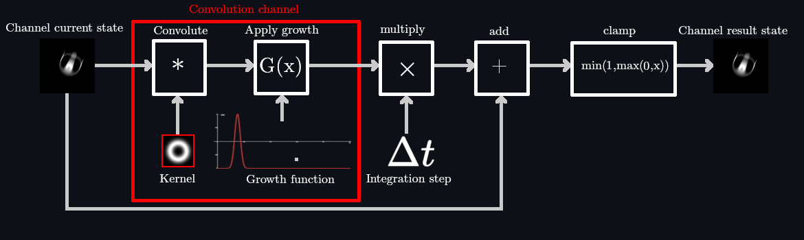
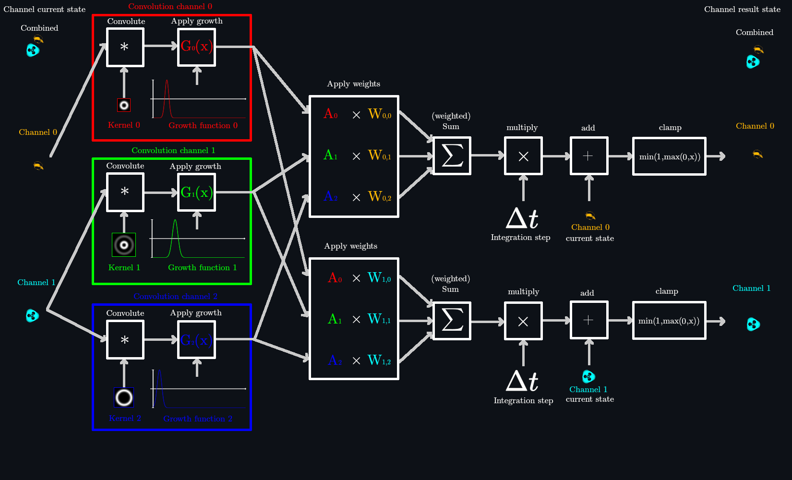

# lenia_ca

This crate has the core functionality for simulating the Lenia system of cellular automata. For more comprehensive documentation, please visit the [docs.rs](https://docs.rs/lenia_ca/0.1.1/lenia_ca/) page for this crate. 

At the time of publishing of this repository and crate, docs.rs does not allow embedding of images (not easily, anyways) in the documentation, and as a result, below are a few graphics viewable on Github showing the working principle of the two types of Lenia that the ``lenia_ca`` crate is able to simulate. 

### The working principle for ``StandardLenia`` is the following:
* Perform a convolution operation (implemented as a FFT-based convolution) between the ``channel`` and ``kernel`` of the ``convolution_channel``
* Each point/pixel's value is then passed into a ``growth_function`` of the ``convolution_channel``.
* The resulting points/pixels are then multiplied by the integration step ``dt`` and added onto the original values in the ``channel``.
* The resulting points/pixels are then clamped to be in range ``0..1``. This result is the next time-step of the ``channel``, and would be used as the next iteration's ``channel`` values. 

use ``set_kernel()`` to change how the kernel looks.

use ``set_growth_function()`` to set a specific growth function for the convolution result.

use ``set_dt()`` to change the integration-step of the simulation. 

### The working principle for ``ExpandedLenia`` is the following:

* For each `convolution_channel`, perform a convolution operation (implemented as a FFT-based convolution) between a source `channel` and the `convolution_channel`'s `kernel`. Notice how each `convolution_channel` takes input from only one `channel`.
* For each `convolution_channel`, pass the convolution results into the `growth_function` of the `convolution_channel`.
* For each `channel`, perform an elementwise multiplication between the corresponding `convolution_channel` results and weights of the `channel`
* For each `channel`, perform a weighted-sum on the results of the weight-convolution multiplicated results. 
* For each `channel`, multiply the weighted-sum by the integration step `dt` and add it to the original values in the `channel`.
* For each `channel`, clamp the resulting values to be in range `0..1`. This result is the next time-step of the corresponding `channel`, and would be used as the next iteration's `channel` values.

use `set_channels()` to set the number of channels in the simulation.

use `set_convolution_channels()` to set the number of kernels and the associated growth functions.

use `set_convolution_channel_source()` to set the channel which will be convoluted by a particular kernel.

use `set_kernel()` to change how a `convolution_channel`'s kernel looks like.

use `set_growth_function()` to set a specific growth function for the convolution result.

use `set_weights()` to set a channel's weights for the corresponding convolution channel results. 

use `set_dt()` to change the integration-step of the simulation. 